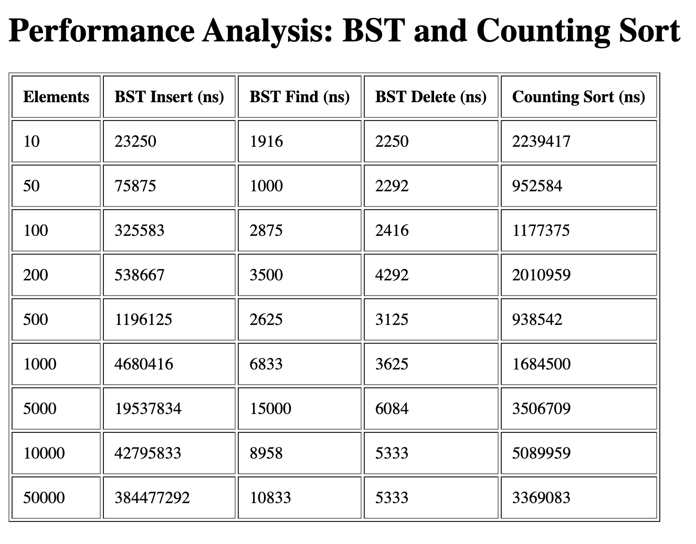
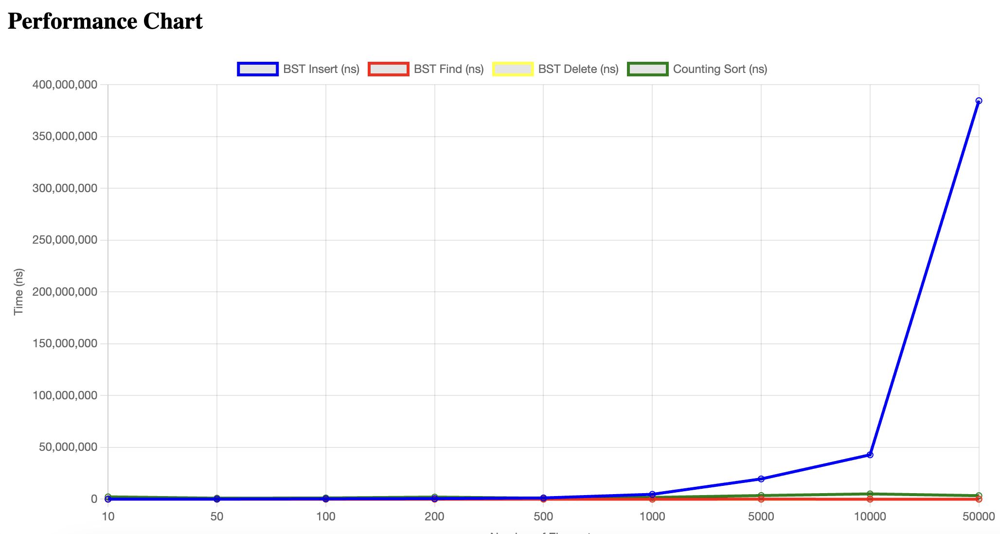

# HW18_Data_Structures_and_Algorithms

## Homework
* Implement class for Balanced Binary Search Tree that can insert, find and delete elements.
* Generate 100 random datasets and measure complexity.
* Implement Counting Sort algorithm.
* Figure out when Counting Sort doesn’t perform.

## Setup
1. `docker compose up`
2. Open link `http://localhost:8000/`

## Results
1) It is not possible to extrapolate this data due to the significant level of noise. The use of random values, along with randomly selecting nodes for finding and deletion, makes the results unpredictable. Predictability could be achievable with larger data samples, but in such cases, the call stack gets exceeded.
   

2) As for counting sort: it becomes impractical when dealing with large value ranges. For example, if there are only 5 values, but the largest value is 10^{10}, we would need to construct an array of size 10^{10}, which is highly inefficient.
   